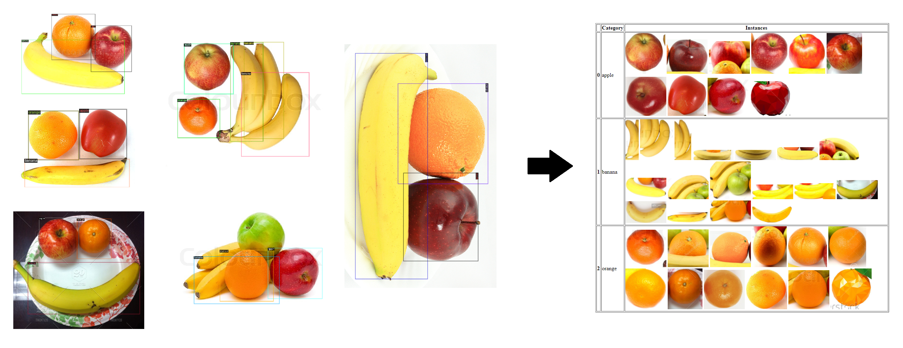

## Annotations List

[](https://zenodo.org/badge/latestdoi/395146071)

Simple tool for visualizing objects category-wise in an annotated dataset. It aims to assist in the data pre-processing stage of building computer vision models. 

(Works with COCO and Pascal VOC annotation formats)

### Usage

1. Create annotated dataset with COCO `.json` or Pascal VOC format `.xml` files (using [LabelImg](https://github.com/tzutalin/labelImg) or similar tool).

2. Move image dataset to `data/images/` folder in the project directory.

3. Move the respective annotation file(s) to `data/annotations/` folder.

	* All data in the `data/instances/` folder will be deleted automatically in every run.

4. Run the `main.py` file in the command line:

```sh
> python main.py
```
5. An HTML file (named `annotations_list.html`) with the table of annotations will be generated and saved in the main project folder.


**Required packages**: [OpenCV](https://pypi.org/project/opencv-python/) 


Example result:

 


### References:

**Rendering images in pandas DataFrame:**
Prabhu, T. (2020). Python. Accessed August 12, 2021 from https://github.com/Tanu-N-Prabhu/Python.


**Fruits dataset:** 
Buyukkinaci, M. (2018, July). Fruit Images for Object Detection, Version 1. Retrieved August 19, 2021 from https://www.kaggle.com/mbkinaci/fruit-images-for-object-detection/.


Any comments and issues are very welcome!
